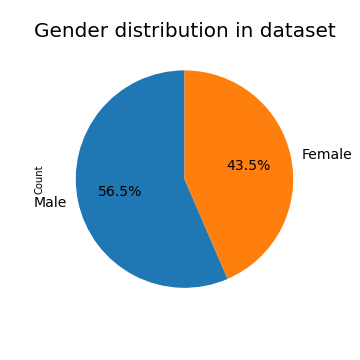
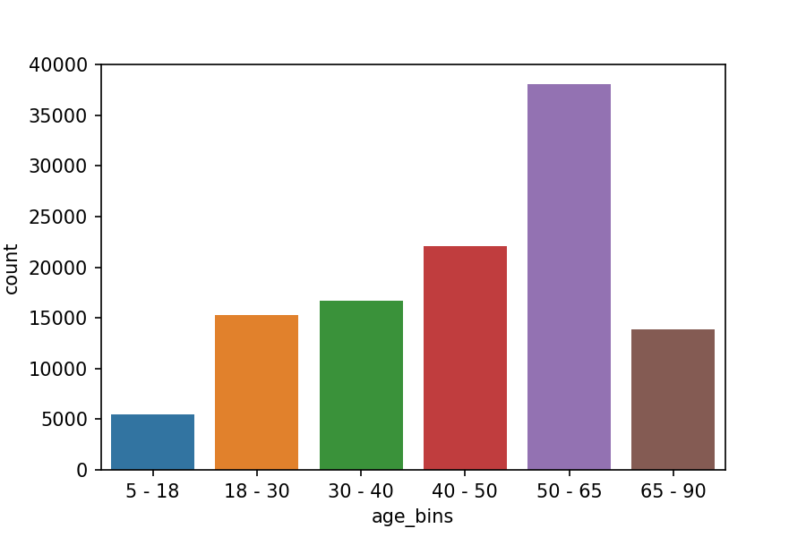
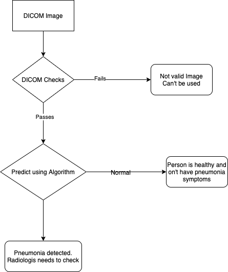
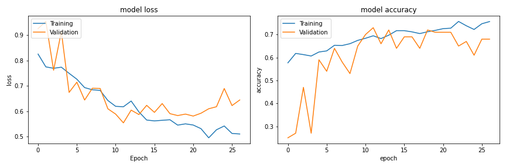
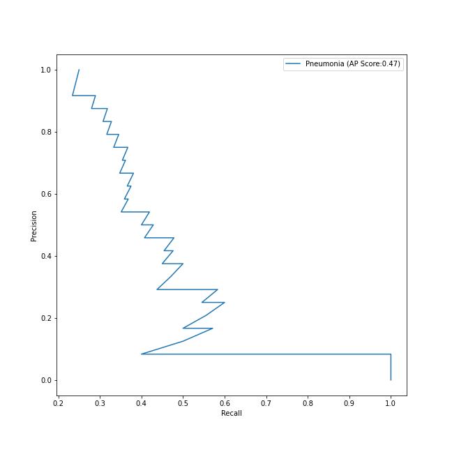
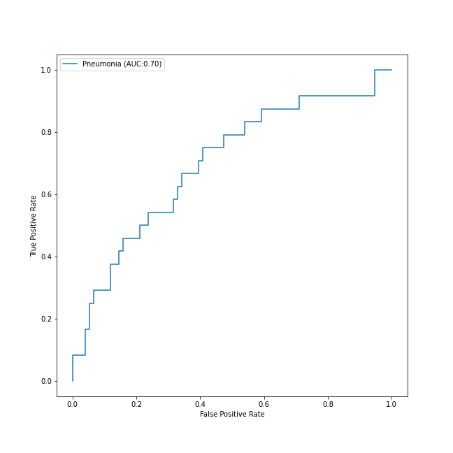
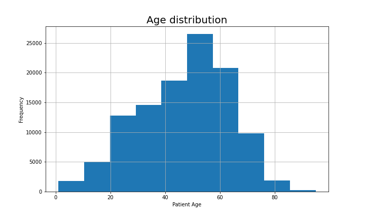
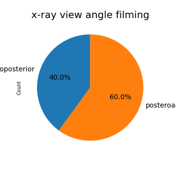
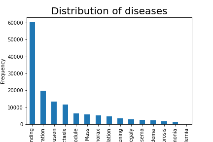
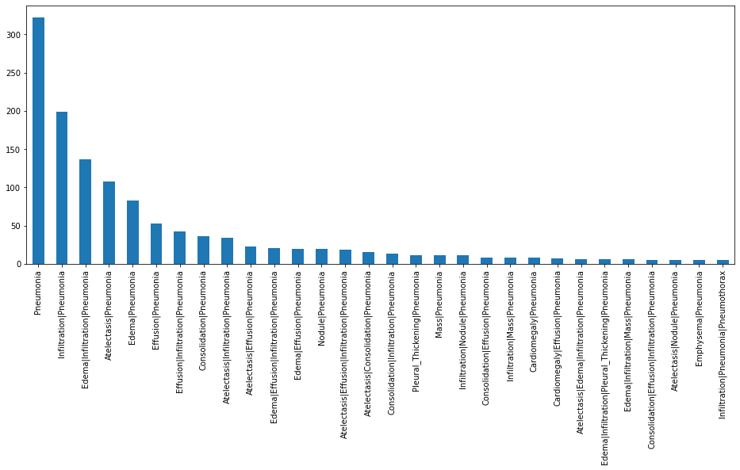

# FDA  Submission

**Gaurav Yadav**

**Pneumonia screener**

## Algorithm Description 

### 1. General Information
The algorithm was trained on 56.5% male and 43.5 female patients whom fall in range of 5 to 90. All the patient were scanned for the **chest X-ray** and were labeled with 14 disease and **No Finding**. From the below plot, it is clear that most of the patients are from age group 50-65. And we can say distribution among gender is almost balance.  

Gender distribution        |  Age distribution
:-------------------------:|:-------------------------:
  |  


**Intended Use Statement:**  
The algorithm is intended to use for Pneumonia patient who has been adminstered to a chest X-ray screening and had never demonstrated a chest abnormalities.

**Indications for Use:**  
The algorithm can be used for screening the pneumonia patient using chest x-ray which can be helpful in early detection of pneumonia. This algorithm would be helpful to the radiologist to filter out the patient who doesn't have pneumonia. 

**Device Limitations:**  
The algorithm is to detect whether patient has pneumonia or not but this can perform poorly in presence of other disease like Atelectasis, Cardiomegaly, Consolidation, Edema, Effusion, Emphysema, Fibrosis, Hernia, Infiltration, Mass, Nodule, Pleural Thickening, or Pneumothorax. If the algorithm say patient has pneumonia then it is possible that it may not have pneumonia as we are focussing more on the recall instead of precision.   
The algorithm is trained using chest x-ray images with view angle AP or PA. So, it's optimal performance would be while using chest x-ray image which are take with view angle of either PA or AP. It will perform poorly on other inputs like CT etc.  


**Clinical Impact of Performance:**
The algorithm can be great help to the radiologist for studying chest xray of a patient. As the algorithm could filter out the patient which don't have pneumonia. Radiologist will have to look at less number of chest xrays.

### 2. Algorithm Design and Function

**Basic flow chart of the system**  
  


**DICOM Checking Steps:**
Below is a list of DICOM checks:
1. DICOM file must be of **chest** body part. (`BodyPartExamined == 'CHEST'`.) 
2. DICOM file should cotain XRAY image only. (`Modality =='DX'`)
3. DICOM image view angle must be either PA or AP. (`PatientPosition in ('PA', 'AP')`)

**Preprocessing Steps:**
Training data contains images with size (1024,1024). For training data has been preprocessed as follow:
* Image has been resized to (224,224)
* Image has been augemented wiht the following parameters
    * Image rescaled to 1/255 to have pixel value in range of 0-1
    * Rotation range of 20 
    * Zoom range of 0.1
    * Shear range of 0.1
    * Horizontal flip applied

**CNN Architecture:**
The alogrithm has been designed using VGG16 pretrained model which was initialy developed for imagenet challenge. Below is the architectural image of VGG and after that Algorithm's structured has been appended.  
After last convolution layer of VGG16, one flatten layer has been added then a batchNormalization then a Dense layer folloing a Dropout layer and lastly Dense layer with single neuron. 
  

Final model:  

```
_________________________________________________________________
Layer (type)                 Output Shape              Param #   
=================================================================
model_2 (Model)              (None, 7, 7, 512)         14714688  
_________________________________________________________________
flatten_2 (Flatten)          (None, 25088)             0         
_________________________________________________________________
batch_normalization_2 (Batch (None, 25088)             100352    
_________________________________________________________________
dense_3 (Dense)              (None, 256)               6422784   
_________________________________________________________________
dropout_2 (Dropout)          (None, 256)               0         
_________________________________________________________________
dense_4 (Dense)              (None, 1)                 257       
```

</br>

### 3. Algorithm Training

**Parameters:**
* Types of augmentation used during training
* Batch size = 100
* Optimizer learning rate = 1e^-4
* Layers of pre-existing architecture that were frozen 
    - first 17 layers of VGG has been frozen
* Layers of pre-existing architecture that were fine-tuned
    - block5_pool
* Layers added to pre-existing architecture
    - Flatten
    - BatchNormalization
    - Dense with activation `relu`
    - Dropout with probability 0.5
    - Dense (last layer with 1 neuron) with sigmoid activation.





And the precision-recall curve has an AP score of 0.47.  


The algorithm has an area under the curve for True positive rate and false positive rate of 0.70.  

**Final Threshold and Explanation:**  
Here, we are specially focused on reduction the number of False positive (FP) and False Negatives(FN), mostly False Negative, of confusion matrix as the numbers of cases under False Positives would conclude that the patients, who are actually Normal, are facing Pneumonia, whereas False Negatives would conclude that the patients, who actually have Pneumonia, are not classified as suffering from Pneumonia.
**Since we can tolerate the number of cases of False Positives, but not False Negatives! This may have serious repercussions if not classified correctly. So it is of utmost importance to reduce the number of cases of False Negatives.**  

So, our focus is to increase the recall instead of precision. Below is the threshold and f1 score for recall of 0.8  
```
Precision is: 0.31666666666666665  
Recall is: 0.7916666666666666  
Threshold is: 0.22881234  
F1 Score is: 0.45238095238095233  
```


### 4. Databases
This NIH Chest X-ray Dataset is comprised of 112,120 X-ray images with disease labels from 30,805 unique patients. To create these labels, the authors used Natural Language Processing to text-mine disease classifications from the associated radiological reports. The labels are expected to be >90% accurate and suitable for weakly-supervised learning. The original radiology reports are not publicly available but you can find more details on the labeling process in this Open Access paper: "ChestX-ray8: Hospital-scale Chest X-ray Database and Benchmarks on Weakly-Supervised Classification and Localization of Common Thorax Diseases." (Wang et al.)

[Link to paper](https://www.nih.gov/news-events/news-releases/nih-clinical-center-provides-one-largest-publicly-available-chest-x-ray-datasets-scientific-community)

#### Data limitations:
* The image labels are NLP extracted so there could be some erroneous labels but the NLP labeling accuracy is estimated to be >90%.
* Very limited numbers of disease region bounding boxes.
* Data is highly imbalanced and has very few pneumonia postive data point. We only have 1.2% of pneumonia patient in whole dataset i.e. `1430/112104`  


**Labels and patient data for the entire dataset**

* Image Index: File name
* Finding Labels: Disease type (Class label)
* Follow-up #
* Patient ID
* Patient Age
* Patient Gender
* View Position: X-ray orientation
* OriginalImageWidth
* OriginalImageHeight
* OriginalImagePixelSpacing_x
* OriginalImagePixelSpacing_y

#### Class descriptions
There are 15 classes (14 diseases, and one for "No findings"). Images can be classified as "No findings" or one or more disease classes:
* Atelectasis
* Consolidation
* Infiltration
* Pneumothorax
* Edema
* Emphysema
* Fibrosis
* Effusion
* Pneumonia
* Pleural_thickening
* Cardiomegaly
* Nodule Mass
* Hernia  


**Description of Training Dataset:** 
Below are some properties fromt the trainig data.
### Gender Disgribution


### Age Distribution
Hist. Age distribution        |  Age bins distribution
:-------------------------:|:-------------------------:
  |  

</br>

### View angle Distribution
 

### Disease Distribution
 

### Pneumonia Co-occurence with other disease
 

It is quite clear from the above analsis, data set is higly imbalanced and has only few positive pneumonia patient. But for the training purpose we are not using the whole data set but a balanced data where number of pneumonia patient is equal to the non-pneumonia patient. Also some outlier data point like age > 110 has been dropped. And all the image has been preprocess before being used by algorithm. 

**Description of Validation Dataset:** 
Dataset has been divided in train and validation set following the 80-20 ratio.
The validation data set doesn't have the same image preprocessing of training. In validation set, we are only resizing the image and normalizing the pixel value, no other additional pre-processing has been applied.

### 5. Ground Truth

The biggest limitation of this dataset is that image labels were NLP-extracted so there could be
some erroneous labels but the NLP labeling accuracy is estimated to be >90%. We can have optimal ground truth if radiologies examine the samples and label them accordingly.  


### 6. FDA Validation Plan
**Patient Population Description for FDA Validation Dataset:** 
For the validation of this algorithm, data should be collected of men and women distributed between the age range of 1-110 with no prior history of pneumonia and other chest abnormal disease like Edema, Effusion, Emphysema, Fibrosis, Hernia, Infiltration, Mass, Nodule, Pleural, Atelectasis, Cardiomegaly,
Consolidation, Thickening, or Pneumothorax.  
Data should be collected as DICOM file with the following properties:
1. `BodyPartExamined` must be `chest` as we have trained the algorithm on chest images only.
2. Image view angle must be either AP or PA. In DICOM file, `PatientPosition` must be either AP or PA.
3. Images are of XRAY type only, means `Modality` of DICOM file must be 'DX'


**Ground Truth Acquisition Methodology:**  
For ground truth, we need to label each of our data collected with class label whether the x-ray image is of pneumonia patient or Non-Pneumonia(Healthy) patient. This can be acheived following the silver standard approach. So, several radiologist can label the collected data with class label (Pneumonia or Heathy(non-pneumonia)). For more optimal ground truth, we should also consider the experience of radiologist. 

**Algorithm Performance Standard:**  
Below is the comparison of our algorithm with other in term of AUROC:


| Pathology  | Wang et al. (2017) | Yao et al. (2017)  | CheXNet | ours |
| ------------- | ------------- | ------------- | ------------- | ------------- |
| Pneumonia  | 0.633  | 0.713  | 0.7680  |0.71  |


Ref: [paper](https://arxiv.org/pdf/1711.05225.pdf) 
 
